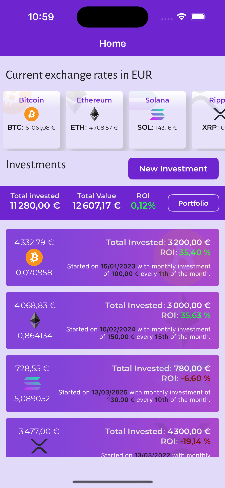
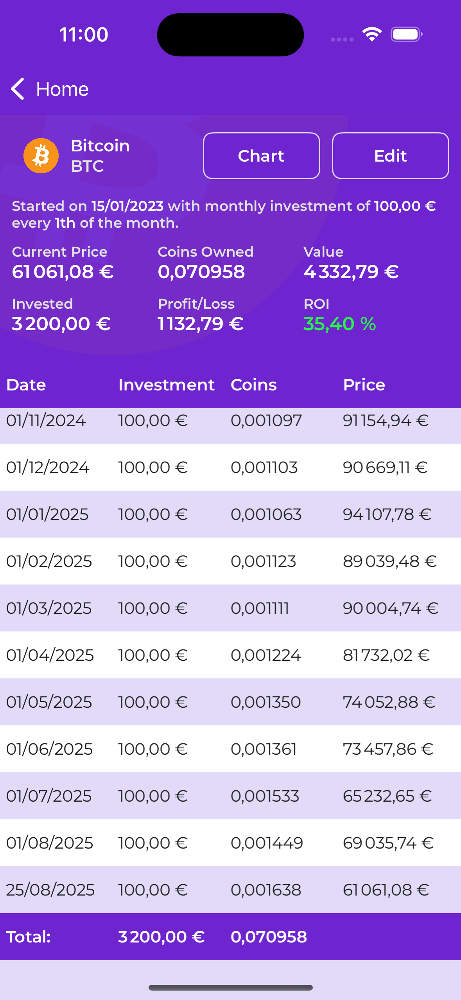
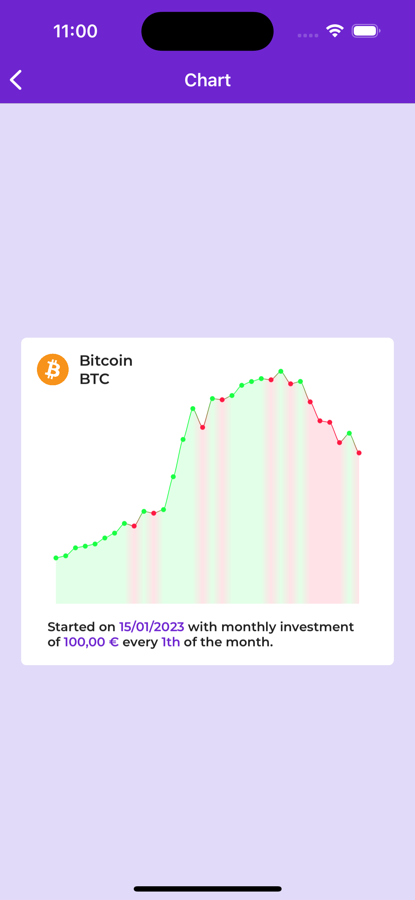
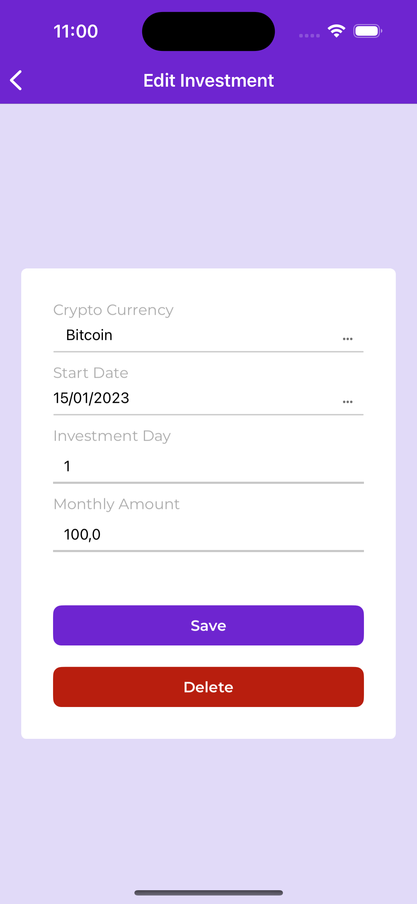
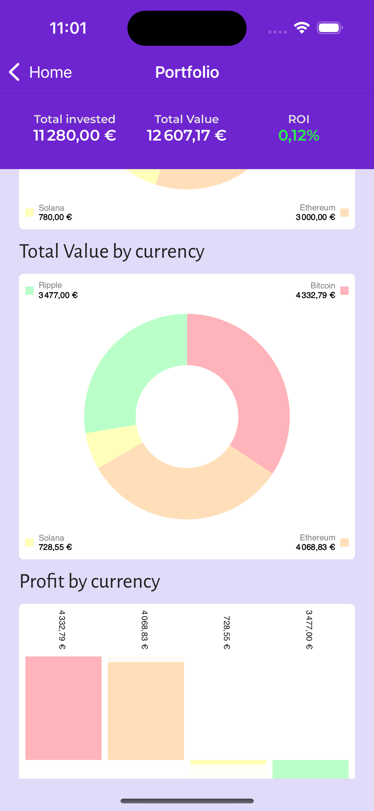

# CryptoDCACalculator

A comprehensive Dollar Cost Averaging (DCA) calculator for cryptocurrency investments.

## Overview

CryptoDCACalculator is a tool designed to help cryptocurrency investors analyze and plan their Dollar Cost Averaging strategies. This application allows users to calculate potential returns, visualize investment patterns, and make informed decisions about their crypto DCA investments.

## Features

- **DCA Strategy Analysis**: Calculate potential returns from regular cryptocurrency investments
- **Historical Data Integration**: Analyze performance based on historical price data
- **Investment Visualization**: Clear charts and graphs to visualize your investment strategy
- **Multiple Cryptocurrency Support**: Support for various cryptocurrencies
- **Flexible Time Periods**: Analyze different investment timeframes
- **Portfolio Tracking**: Monitor your DCA performance over time

## Screenshots

### Application Interface

*Main application interface*


*DCA calculation results*

### Data Visualization

*Investment performance charts*


*Historical analysis view*

### Additional Features

*Portfolio tracking interface*


*Settings and configuration*


*Detailed analytics dashboard*

## Getting Started

### Prerequisites
- [List any prerequisites here, e.g., Python 3.x, Node.js, etc.]

### Installation
1. Clone the repository:
   ```bash
   git clone https://github.com/yourusername/CryptoDCACalculator.git
   ```

2. Navigate to the project directory:
   ```bash
   cd CryptoDCACalculator
   ```

3. [Add specific installation steps based on your project type]

### Usage
[Add usage instructions here]

## How DCA Works

Dollar Cost Averaging (DCA) is an investment strategy where you invest a fixed amount of money at regular intervals, regardless of the asset's price. This strategy can help:

- Reduce the impact of volatility
- Lower the average cost per unit over time
- Remove the need to time the market
- Build disciplined investment habits

## Contributing

Contributions are welcome! Please feel free to submit a Pull Request.

## License

This project is licensed under the terms specified in the LICENSE file.

## Disclaimer

This tool is for educational and informational purposes only. It should not be considered as financial advice. Always do your own research and consider consulting with a financial advisor before making investment decisions.

---

*For more information, questions, or support, please open an issue on GitHub.*