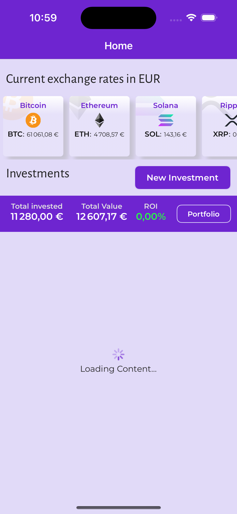

# CryptoDCACalculator

A comprehensive mobile application for cryptocurrency Dollar Cost Averaging (DCA) investment tracking and management.

## Overview

CryptoDCACalculator is a mobile app designed to help cryptocurrency investors track and manage their Dollar Cost Averaging strategies. The application provides real-time portfolio tracking, detailed investment history, visual analytics, and comprehensive performance metrics for multiple cryptocurrency investments.

## Features

- **Multi-Currency Support**: Track DCA investments across Bitcoin, Ethereum, Solana, Ripple, and other cryptocurrencies
- **Real-time Price Tracking**: Live exchange rates displayed in EUR with automatic updates (**This functionality is mocked up and use test data**)
- **Investment Management**: Create, edit, and delete DCA investment plans with customizable schedules
- **Detailed Portfolio Analytics**: Comprehensive ROI tracking, profit/loss calculations, and investment performance metrics
- **Visual Data Representation**: Interactive charts showing price trends and portfolio distribution
- **Investment History**: Complete transaction history with dates, amounts, and purchase prices
- **Portfolio Overview**: Consolidated view of total investments, current values, and overall performance
- **User Authentication**: Secure login system with account management

## Screenshots

### User Authentication


*Login screen - Secure access to your DCA portfolio with email/password authentication and account creation options*

### Home Dashboard


*Home screen - Real-time cryptocurrency prices in EUR with portfolio summary showing loading state


*Investment overview - Detailed list of all DCA investments including Bitcoin (+35.40% ROI), Ethereum (+35.5% ROI), Solana (-6.60% ROI), and Ripple (-19.14% ROI)*

### Investment Details & History


*Bitcoin investment details - Complete transaction history showing monthly €100 investments from January 2023, with detailed breakdown of dates, amounts, coins purchased, and prices*

### Data Visualization


*Price chart - Interactive Bitcoin price visualization showing DCA investment performance with green (profit) and red (loss) periods highlighted*

### Investment Management


*Investment editor - Create and modify DCA investments with options for cryptocurrency selection, start date, investment day, and monthly amount configuration*

### Portfolio Analytics


*Portfolio dashboard - Comprehensive analytics including asset allocation pie chart and profit/loss breakdown by cryptocurrency with visual bar charts*

## Getting Started

### Prerequisites
- .NET 8 SDK or later
- Visual Studio 2022 17.8+ or Visual Studio Code with C# extension
- For Android: Android SDK and emulator or physical device
- For iOS: Xcode (macOS only) and iOS simulator or physical device
- Internet connection for real-time cryptocurrency price data

### Installation & Setup

#### Development Environment
1. **Clone the repository:**
   ```bash
   git clone https://github.com/yourusername/CryptoDCACalculator.git
   ```

2. **Navigate to the project directory:**
   ```bash
   cd CryptoDCACalculator
   ```

3. **Restore dependencies:**
   ```bash
   dotnet restore
   ```

4. **Build the project:**
   ```bash
   dotnet build
   ```

#### Running the Application

**For Android:**
```bash
dotnet build -t:Run -f net8.0-android
```

**For iOS (macOS only):**
```bash
dotnet build -t:Run -f net8.0-ios
```

#### Using Visual Studio
1. Open `CryptoDCACalculator.sln` in Visual Studio 2022
2. Select your target platform (Android, iOS, or Windows)
3. Choose your device/emulator
4. Press F5 or click "Start Debugging"

## Usage Guide - Screen by Screen

### 1. Authentication (Screenshot 1)


**Login Screen Features:**
- **Welcome Message**: "Welcome back! Access your existing account"
- **Email Input**: Enter your registered email address
- **Password Input**: Secure password field
- **Login Button**: Primary purple button to access your account
- **Create Account**: Alternative white button for new users
- **Forgot Password**: Link to reset password functionality

**How to Use:**
1. Just click Login, as this page is only for test purposes 

### 2. Home Dashboard - Portfolio Overview (Screenshot 2)


**Dashboard Features:**
- **Current Exchange Rates**: Live prices in EUR for Bitcoin (€61,061.08), Ethereum (€4,708.57), Solana (€143.16), Ripple
- **Portfolio Summary**: 
  - Total Invested: €11,280.00
  - Total Value: €12,607.17
  - ROI: 0.00% (displayed in green)
- **New Investment Button**: Purple button to create new DCA plans
- **Portfolio Button**: Access to detailed portfolio analytics

**How to Use:**
1. Monitor real-time cryptocurrency prices in the top section
2. Check your overall portfolio performance in the summary bar
3. Tap "New Investment" to create a new DCA plan
4. Tap "Portfolio" to view detailed analytics

### 3. Home Dashboard - Investment List (Screenshot 3)


**Investment Cards Display:**
- **Bitcoin Investment**: €4,332.79 value, €3,200.00 invested, +35.40% ROI (green)
- **Ethereum Investment**: €4,068.83 value, €3,000.00 invested, +35.5% ROI (green)
- **Solana Investment**: €728.55 value, €780.00 invested, -6.60% ROI (red)
- **Ripple Investment**: €3,477.00 value, €4,300.00 invested, -19.14% ROI (red)

**How to Use:**
1. Scroll through your investment cards to see all DCA plans
2. Each card shows current value, total invested, and ROI percentage
3. Green ROI indicates profit, red indicates loss
4. Tap any card to view detailed transaction history
5. Investment details include start date and monthly amount

### 4. Investment Details - Transaction History (Screenshot 4)


**Detail View Features:**
- **Investment Summary**: Current price (€61,061.08), coins owned (0.070958), current value (€4,332.79)
- **Performance Metrics**: Total invested (€3,200.00), profit (€1,132.79), ROI (+35.40%)
- **Action Buttons**: "Chart" and "Edit" buttons
- **Transaction History**: Detailed list showing:
  - Date of each investment
  - Amount invested (€100.00 monthly)
  - Coins purchased
  - Price at time of purchase

**How to Use:**
1. Review your investment performance at the top
2. Use "Chart" button to view price visualization
3. Use "Edit" button to modify investment parameters
4. Scroll through transaction history to see all purchases
5. Each row shows exactly how many coins were bought and at what price

### 5. Price Chart Visualization (Screenshot 5)


**Chart Features:**
- **Interactive Price Line**: Green and red line showing Bitcoin price movement
- **DCA Entry Points**: Dots marking each monthly investment
- **Color-coded Background**: Green areas show profitable periods, red shows losses
- **Investment Details**: Shows start date (15/01/2023) and monthly amount (€100.00)

**How to Use:**
1. Analyze price trends over your investment period
2. Green dots indicate purchases during profitable periods
3. Red dots show purchases during loss periods
4. The background shading helps visualize overall performance
5. Use this chart to understand how DCA smooths out price volatility

### 6. Investment Management - Edit Screen (Screenshot 6)


**Configuration Options:**
- **Crypto Currency**: Dropdown to select Bitcoin, Ethereum, Solana, etc.
- **Start Date**: Date picker (currently set to 15/01/2023)
- **Investment Day**: Day of month for purchases (1-31, currently set to 1)
- **Monthly Amount**: EUR amount for each purchase (currently €100.0)
- **Save Button**: Purple button to confirm changes
- **Delete Button**: Red button to remove the investment plan

**How to Use:**
1. Select different cryptocurrency from the dropdown menu
2. Adjust start date using the date picker
3. Choose which day of the month to make purchases (1-31)
4. Set your monthly investment amount in EUR
5. Tap "Save" to apply changes or "Delete" to remove the plan

### 7. Portfolio Analytics Dashboard (Screenshot 7)


**Analytics Features:**
- **Total Portfolio**: €11,280.00 invested, €12,607.17 current value, 0.12% ROI
- **Asset Allocation Pie Chart**: Visual breakdown of portfolio distribution
  - Bitcoin: €4,332.79 (largest red segment)
  - Ethereum: €4,068.83 (orange segment)
  - Ripple: €3,477.00 (green segment)
  - Solana: €728.55 (yellow segment)
- **Profit by Currency Bar Chart**: Visual comparison of gains/losses per cryptocurrency

**How to Use:**
1. Monitor overall portfolio performance at the top
2. Use the pie chart to understand asset allocation
3. The bar chart shows which investments are performing best
4. Longer bars indicate higher absolute profits or losses
5. Use this view to rebalance your portfolio if needed

## Key Navigation Tips:
- **Back Button**: Use the arrow in the top-left to return to previous screens
- **Home Button**: Access main dashboard from any screen
- **Color Coding**: Green indicates profits, red indicates losses throughout the app
- **Real-time Updates**: All prices and values update automatically when connected to internet

## How Dollar Cost Averaging (DCA) Works

Dollar Cost Averaging (DCA) is an investment strategy where you invest a fixed amount of money at regular intervals, regardless of the asset's price. This strategy can help:

- Reduce the impact of volatility
- Lower the average cost per unit over time
- Remove the need to time the market
- Build disciplined investment habits

## Technical Stack

- **Framework**: .NET MAUI (Multi-platform App UI)
- **Target Platforms**: Android, iOS, Windows
- **Language**: C#
- **UI Framework**: XAML with platform-specific styling
- **Data Storage**: Local SQLite database with secure storage for credentials
- **API Integration**: Real-time cryptocurrency price feeds
- **Charts**: Custom chart controls for price visualization

## Contributing

Contributions are welcome! Please feel free to submit a Pull Request.

## License

This project is licensed under the terms specified in the LICENSE file.

## Disclaimer

This tool is for educational and informational purposes only. It should not be considered as financial advice. Always do your own research and consider consulting with a financial advisor before making investment decisions.

---

*For more information, questions, or support, please open an issue on GitHub.*
